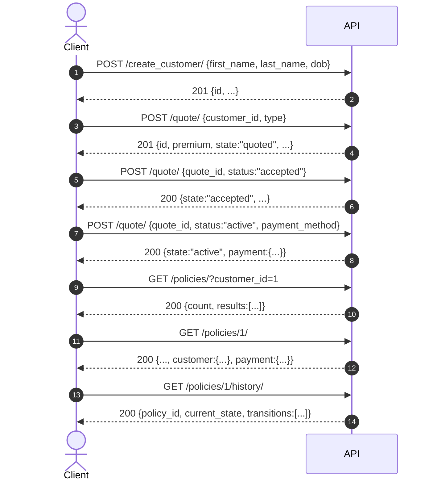

# API Reference

Base path: `/api/v1`. Money is `Decimal`, serialised as strings. Dates render
`DD-MM-YYYY` (ISO accepted on input). Every error uses one envelope:

```json
{"error": {"code": "invalid_state_transition", "message": "...", "details": {}}}
```

Interactive docs: [`/api/v1/docs/`](/api/v1/docs/) (Swagger) and
[`/api/v1/redoc/`](/api/v1/redoc/); the raw schema is at `/api/v1/schema/`.
Authentication is described in [AUTHENTICATION.md](AUTHENTICATION.md).

## The flow (sequence diagram)

This recreates `docs/assets/sequence-diagram.png` so the contract stays legible
in a diff.



## Endpoints

| # | Method | Path | Purpose |
|---|--------|------|---------|
| 1 | POST | `/create_customer/` (alias `POST /customers/`) | Create a customer |
| 2 | POST | `/quote/` with `{customer_id, type}` | Create a quote (also `POST /quotes/`) |
| 3 | POST | `/quote/` with `{quote_id, status:"accepted"}` | Accept (also `POST /quotes/{id}/accept/`) |
| 4 | POST | `/quote/` with `{quote_id, status:"active"}` | Pay & bind (also `POST /quotes/{id}/pay/`) |
| 5 | GET | `/policies/?customer_id=` | List policies (also `state`, `type`, `q`) |
| 6 | GET | `/policies/{id}/` | Policy detail (nested customer + payment) |
| 7 | GET | `/policies/{id}/history/` | Full transition history |
| — | GET | `/customers/?q=&first_name=&last_name=&dob=&policy_type=` | Customer search |
| — | GET | `/search/?q=&entity=all\|customers\|policies` | Unified search |
| — | POST | `/auth/token/`, `/auth/token/refresh/`, `/auth/token/verify/`, `/auth/logout/` | JWT |
| — | GET | `/auth/me/` | Current principal |

Every RPC-style route also answers without its trailing slash, so paths copied
straight off the diagram work verbatim.

## Examples

**Create quote** — `POST /api/v1/quote/`

```json
{"customer_id": 1, "type": "personal-accident"}
```

```json
{
  "id": 1, "quote_reference": "QT-2026-XXXXXXXX", "customer_id": 1,
  "type": "personal-accident", "premium": "200.00", "cover": "200000.00",
  "currency": "AED", "state": "quoted", "rated_age": 35,
  "quoted_at": "2026-08-13T18:21:00Z", "quote_expires_at": "2026-09-12T18:21:00Z",
  "payment": null
}
```

**Pay** — `POST /api/v1/quote/` `{"quote_id": 1, "status": "active"}` → `200`
with `state: "active"` and a `payment` object (`simulated_card` settles to
`succeeded`; `invoice` stays `pending`). Both bind the policy.

**History** — `GET /api/v1/policies/1/history/` returns the four-entry narrative
`null→new→quoted→accepted→active`.

## Rules that shape the contract

- `premium` is server-computed and **rejected** on input (ADR-0004).
- Illegal state moves are `409 invalid_state_transition`; unknown ids `404`;
  bad input `400`; anonymous (when locked) `401` (ADR-0002, ADR-0003).
- `Idempotency-Key` on pay makes retries safe; a reused key with a different
  body is `409 duplicate_request` (ENH-05).

See the [ADRs](adr/) for the reasoning behind each decision.
