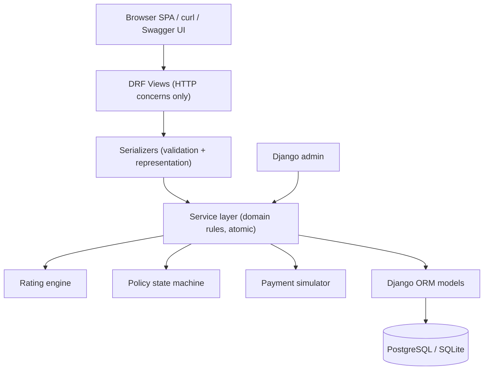
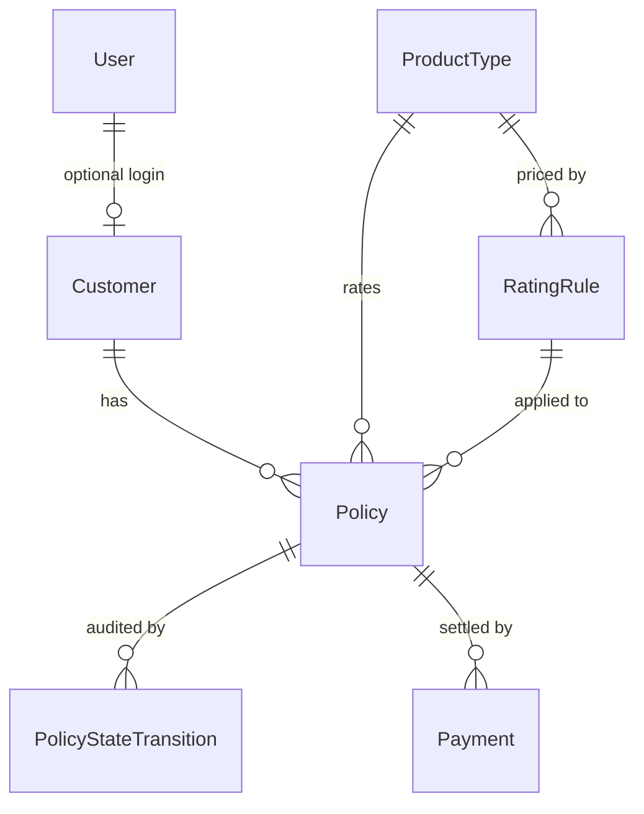
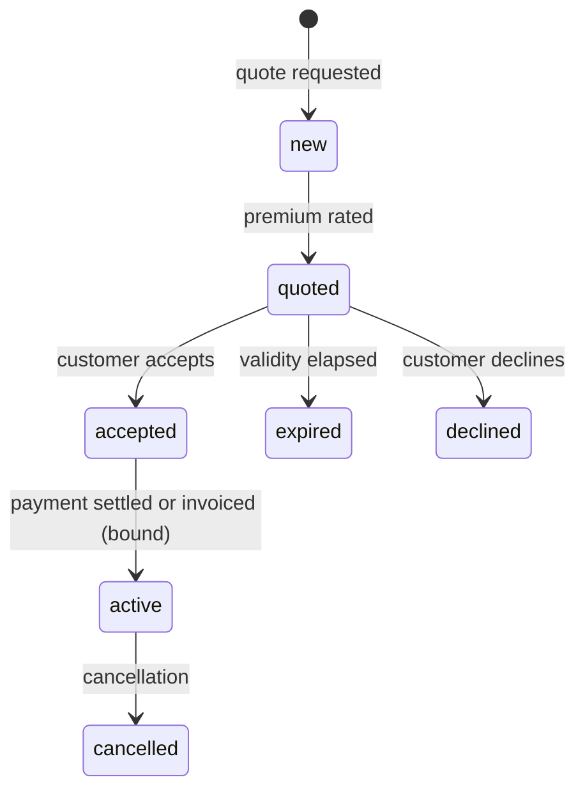

# Democrance Technical Test — Requirements & Design Specification

Version: 1.0
Date: 2026-08-13
Author: Samit Pawar
Status: Approved for implementation (all open questions answered — see Section 3)

---

## 1. Purpose of this document

The brief is deliberately loose ("intentionally not too specific... the idea is to see the development
process, and to see what aspects of the development are considered important"). This document therefore
does two jobs:

1. **Pins down every stated requirement** into an unambiguous, testable specification, with a
   traceability ID for each so nothing can silently go missing.
2. **Records every design decision and its rationale**, including where the brief and the sequence
   diagram disagree, and every enhancement made beyond the literal brief.

The companion document [MASTER-PLAN.md](MASTER-PLAN.md) turns this specification into an ordered,
test-driven execution plan. This document says *what and why*; the master plan says *in what order,
which test first*.

Nothing in the brief has been dropped. Where something is added, it is tagged `ENH-nn` and justified.

---

## 2. Source artefacts and how they were interpreted

Three inputs define the work, and they do not perfectly agree:

- **The written brief** (Parts 1–4, plus the sample `customer` and `policy/quote` payloads).
- **The sequence diagram** (`docs/assets/sequence-diagram.png`), which shows seven browser-to-API
  interactions against a single DB.
- **The acceptance criteria**, which are stated per part and are the literal pass/fail gate.

### 2.1 The seven interactions in the sequence diagram

| # | Diagram step | Method + path | Request body (from diagram) | Response |
|---|---|---|---|---|
| 1 | Customer creation | `POST /api/v1/create_customer/` | `{first_name, last_name, dob}` | JSON with customer details |
| 2 | Quote creation | `POST /api/v1/quote/` | `{customer_id, type}` | JSON with quote details |
| 3 | Accept quote | `POST /api/v1/quote/` | `{quote_id, status: "accepted"}` | JSON with accepted quote details |
| 4 | Pay quote | `POST /api/v1/quote/` | `{quote_id, status: "active"}` | JSON with paid quote details |
| 5 | List policies | `GET /api/v1/policies/?customer_id=<id>` | — | JSON list of the customer's policies |
| 6 | Policy details | `GET /api/v1/policies/<id>/` | — | JSON with policy details |
| 7 | Policy history | `GET /api/v1/policies/<id>/history/` | — | JSON with policy history |

### 2.2 Conflicts between brief and diagram, and the resolution

These are real ambiguities, not oversights. Each is resolved explicitly and each resolution is recorded
as an ADR in `docs/adr/`.

- **`create_customer` vs REST.** The brief and diagram both say `POST /api/v1/create_customer/`, which is
  an RPC-style path in an otherwise resource-oriented API. **Resolution:** the literal path is the
  primary, tested, documented contract because the acceptance criteria depend on it. A REST alias
  `POST /api/v1/customers/` is additionally exposed by the same view (`ENH-01`). ADR-0001.
- **One `/quote/` endpoint doing three different things.** The diagram overloads `POST /api/v1/quote/`
  for create, accept, and pay, discriminated by which keys are present (`customer_id`+`type` vs
  `quote_id`+`status`). **Resolution:** implement exactly that, via an explicit request-dispatching
  serializer, so the diagram replays 1:1. Also expose `POST /api/v1/quotes/`,
  `POST /api/v1/quotes/<id>/accept/`, `POST /api/v1/quotes/<id>/pay/` as clean REST actions delegating
  to the same service functions (`ENH-01`). ADR-0002.
- **State vocabulary: `bound` vs `active` vs `accepted`.** Part 2 prose says history is
  "new/quoted/bound"; the field list says `state: [new/quoted/active]`; the diagram posts `accepted`
  then `active`. **Resolution:** the canonical state machine is
  `new -> quoted -> accepted -> active`, where **`active` is the bound state** and the word "bound" is
  documented as a synonym of `active`. `accepted` is required because the diagram has a distinct
  accept step before payment. ADR-0003.
- **`premium` in the request payload.** The brief lists `premium` as a field of the policy/quote object,
  but a premium supplied by the client would make the rating engine meaningless and is an obvious
  integrity hole. **Resolution:** `premium` is a first-class model field and appears in every response,
  but is **server-computed and read-only on input**; a client-supplied `premium` is rejected with a
  clear 400 rather than silently ignored. `cover` *is* client-settable within product limits.
  ADR-0004.
- **`dob` format `25-06-1991`.** Not ISO 8601, and ambiguous against US `MM-DD-YYYY`. **Resolution:**
  `DD-MM-YYYY` per the brief. Input accepts both `DD-MM-YYYY` and `YYYY-MM-DD`; output renders
  `DD-MM-YYYY` to match the brief exactly. Implemented as a single reusable `FlexibleDateField`.
  ADR-0005.

---

## 3. Confirmed decisions (answers to the open questions)

| # | Question | Decision |
|---|---|---|
| D1 | API shape | Mirror the diagram exactly **and** add REST action aliases |
| D2 | `dob` format | Accept `DD-MM-YYYY` + ISO on input; return `DD-MM-YYYY` |
| D3 | Authentication | Implement it (not just discuss): JWT via `simplejwt`, two principals — staff/agent and customer — plus a written discussion doc for Part 4 |
| D4 | Auth vs reviewer friction | Auth enforced in code, but `DEMO_OPEN_API=true` (default in `.env.example`) opens the seven diagram endpoints so the acceptance criteria pass with a bare `curl`. Both modes are tested |
| D5 | Infrastructure | Docker Compose + PostgreSQL, **plus** a zero-setup SQLite fallback so `python manage.py runserver` works with no Docker |
| D6 | Rating | DB-driven `RatingRule` table (product, age band, rate), seeded by migration, editable in Django admin |
| D7 | State history | Explicit immutable `PolicyStateTransition` model written by a service-layer state machine (no third-party history package) |
| D8 | Search | `django-filter` query params on list endpoints **and** a unified `GET /api/v1/search/` |
| D9 | Repo + tests | Folder `democrance-insurance-api/`; pytest + pytest-django + factory_boy + coverage gate; strict red-green-refactor TDD; docs in `docs/` |
| D10 | Reviewer ergonomics | OpenAPI schema + Swagger UI, plus a `Makefile` (`make up`, `make test`, `make demo`, `make seed`) |
| D11 | UI | A single static HTML file (vanilla JS + `fetch`, no npm/build step) served by Django at `/`, walking all seven diagram calls with visible request/response JSON |

---

## 4. Requirement traceability

Every requirement below is testable, and every one maps to at least one named test in
[MASTER-PLAN.md](MASTER-PLAN.md).

### Part 1 — Customer creation

- **REQ-P1-1** A new Django project exists and `python manage.py runserver` starts the development
  server successfully.
- **REQ-P1-2** Endpoint `POST /api/v1/create_customer/` accepts a JSON object.
- **REQ-P1-3** A `Customer` model exists with at least `first_name`, `last_name`, `dob`, and the
  database is migrated via checked-in migration files.
- **REQ-P1-4** Posting `{"first_name": "Ben", "last_name": "Stokes", "dob": "25-06-1991"}` creates a
  customer and returns `201` with the persisted representation including its `id`.
- **REQ-P1-5** The POST is reproducible for acceptance testing: an executable end-to-end test suite
  plus Swagger UI plus `make demo`.
- **REQ-P1-6** The saved customer is visible and correct in the Django admin.
- **REQ-P1-7** Work is in a git repository with meaningful, incremental commits that a reviewer can
  clone and read as a development narrative.

### Part 2 — Quote and policy lifecycle

- **REQ-P2-1** Endpoint `POST /api/v1/quote/` exists.
- **REQ-P2-2** A `Policy` model exists with at least `type`, `premium`, `cover`, `state`, plus a
  migration.
- **REQ-P2-3** A customer can create a quote; the premium is derived from customer age band and cover.
- **REQ-P2-4** A quote can be accepted, then converted into a live (bound/`active`) policy, with
  payment simulated (card) or deferred to invoice.
- **REQ-P2-5** Policy state history is queryable and shows the full ordered progression
  `new -> quoted -> accepted -> active`.
- **REQ-P2-6** Django admin shows each policy associated with the correct customer (the stated
  acceptance criterion).
- **REQ-P2-7** Illegal transitions (for example paying a quote that was never accepted, or accepting an
  already-active policy) are rejected with `409` and are never recorded in history.

### Part 3 — Search

- **REQ-P3-1** Customers are findable by name (first, last, partial, case-insensitive).
- **REQ-P3-2** Customers are findable by `dob` (accepting both input formats).
- **REQ-P3-3** Customers and policies are findable by policy type.
- **REQ-P3-4** Policies are listable/filterable by `customer_id`, `state`, and `type`; results are
  paginated and consistently ordered.

### Part 4 — Authentication

- **REQ-P4-1** A written discussion (`docs/AUTHENTICATION.md`) covering whether users and customers are
  the same or different identities, the trade-offs, and what a production build would add.
- **REQ-P4-2** Working implementation: JWT issue/refresh/verify/logout, a custom user model with roles,
  and per-object scoping so a customer principal can only ever see and act on its own records.

---

## 5. Architecture

### 5.1 Layering

A thin-view / fat-service design, because the interesting logic here (rating, state transitions,
payment) must be unit-testable without HTTP and reusable from both the API and the Django admin.



Rules enforced by review and by tests:

- Views contain no business rules; they call exactly one service function.
- Services are the only place that mutates `Policy.state`, and they always write a
  `PolicyStateTransition` in the same transaction.
- Serializers never write to the database directly for lifecycle operations.
- The rating engine is a pure function of `(product, age, cover, as_of_date)` plus the rules table.

### 5.2 Django apps

Deliberately split by bounded responsibility rather than one monolithic `api` app, so ownership and
tests stay obvious.

| App | Responsibility | Key contents |
|---|---|---|
| `apps.common` | Shared primitives with no domain knowledge | `TimeStampedModel`, `FlexibleDateField`, DRF exception handler, error codes, pagination, `assert_num_queries` helpers |
| `apps.accounts` | Identity and authorisation | Custom `User` (email login, `role`), JWT views, `IsStaff`, `IsStaffOrOwningCustomer`, demo-mode permission shim |
| `apps.customers` | Customer master data | `Customer`, serializers, `create_customer` + REST alias views, filters, admin |
| `apps.products` | Product catalogue and pricing rules | `ProductType`, `RatingRule`, `rating.calculate_premium()`, seed migration, admin |
| `apps.policies` | Quote and policy lifecycle | `Policy`, `PolicyStateTransition`, `services.py` (create/accept/activate), state machine, `/quote/` dispatch view, list/detail/history views, admin |
| `apps.payments` | Simulated settlement | `Payment`, `simulate_payment()`, idempotency handling, admin |
| `apps.search` | Cross-entity search | Unified `GET /api/v1/search/` |
| `apps.web` | Demo client | `TemplateView` at `/` serving the single-file SPA |

### 5.3 Repository layout

```
democrance-insurance-api/
├── README.md                     # quickstart, acceptance-criteria walkthrough, design summary
├── Makefile                      # up / down / test / lint / migrate / seed / demo / superuser
├── docker-compose.yml            # api + postgres (+ volume)
├── Dockerfile
├── .env.example                  # DEMO_OPEN_API=true by default
├── .gitignore
├── .pre-commit-config.yaml       # ruff lint + format
├── pyproject.toml                # ruff, pytest, coverage config
├── requirements/
│   ├── base.txt
│   └── dev.txt
├── manage.py
├── config/
│   ├── settings/{__init__,base,dev,test,prod}.py
│   ├── urls.py                   # /api/v1/, /admin/, /healthz/, docs, SPA
│   ├── wsgi.py
│   └── asgi.py
├── apps/
│   ├── common/
│   ├── accounts/
│   ├── customers/
│   ├── products/
│   ├── policies/
│   ├── payments/
│   ├── search/
│   └── web/                      # templates/index.html, static/app.js
├── tests/
│   ├── conftest.py               # shared fixtures, factories registration
│   ├── e2e/test_sequence_diagram_flow.py
│   └── e2e/test_acceptance_criteria.py
├── docs/
│   ├── REQUIREMENTS.md           # this document
│   ├── MASTER-PLAN.md
│   ├── AUTHENTICATION.md         # Part 4
│   ├── API.md                    # human-readable contract + curl for all 7 calls
│   ├── adr/0001..0008-*.md
│   └── assets/sequence-diagram.png
└── .github/workflows/ci.yml
```

Unit and integration tests live beside the code they cover (`apps/<app>/tests/test_*.py`); only
cross-app end-to-end tests live in the top-level `tests/` package.

### 5.4 Technology and versions

Versions verified against PyPI on 2026-08-13. Django 5.2 LTS is chosen over 6.1 because
`djangorestframework-simplejwt` 5.5.1 declares support only up to Django 5.2 — an LTS with a fully
compatible dependency set is worth more than a newer minor.

- Python 3.12+ (developed on 3.14; Docker image `python:3.14-slim`)
- Django 5.2 LTS (`~=5.2.17`), Django REST Framework 3.18.0
- `djangorestframework-simplejwt` 5.5.1 (with token blacklist app)
- `drf-spectacular` 0.30.0 (OpenAPI 3 + Swagger UI + ReDoc)
- `django-filter` 26.1
- `psycopg` 3.3.4, `dj-database-url` 3.1.2, `python-decouple` 3.8
- `whitenoise` 6.12.0, `gunicorn` 26.0.0 (container serving)
- Dev/test: `pytest` 9.1.1, `pytest-django` 4.14.0, `pytest-cov` 7.1.0, `factory-boy` 3.3.3,
  `time-machine` 3.4.0 (deterministic age/expiry tests), `ruff` 0.16.3, `pre-commit` 4.6.2

Settings are split (`base`/`dev`/`test`/`prod`) and read from the environment via `python-decouple`;
`DATABASE_URL` selects PostgreSQL, and its absence falls back to SQLite (D5). Tests default to
in-memory SQLite for speed, and CI additionally runs the whole suite against PostgreSQL so no
Postgres-specific behaviour goes unverified.

---

## 6. Data model

Common base: `TimeStampedModel` provides `created_at` / `updated_at` (auto, indexed on `created_at`).
All money is `Decimal` — never `float`.

### 6.1 `accounts.User`

Custom user from the very first migration, because swapping `AUTH_USER_MODEL` later is genuinely
painful.

- `email` — unique, `USERNAME_FIELD`
- `role` — `staff` | `agent` | `customer` (choices; also mirrored into Django groups for admin
  convenience)
- `first_name`, `last_name`, `is_active`, `is_staff`, `is_superuser`, `date_joined`
- Manager with `create_user` / `create_superuser`

### 6.2 `customers.Customer`

- `id` — `BigAutoField` (integer, because the diagram uses `"customer_id": 1`)
- `reference` — `UUID`, unique, auto (safe external identifier; `ENH-02a`)
- `first_name`, `last_name` — `CharField(100)`, non-blank, whitespace-stripped
- `dob` — `DateField`; must be in the past; age must be within `[MIN_AGE=18, MAX_AGE=100]`
  (configurable) — an insurer cannot rate outside its filed bands
- `email` — optional, unique when present; `phone` — optional
- `user` — `OneToOneField(User, null=True, blank=True, on_delete=SET_NULL,
  related_name="customer_profile")`, the link that lets a customer principal log in
- Indexes: `(last_name, first_name)`, `dob` — these are exactly the Part 3 search paths
- `age_at(as_of: date) -> int` and an `age` property (no birthday-off-by-one bug: subtract one if the
  anniversary has not yet occurred)
- No uniqueness constraint on `(first_name, last_name, dob)`: real people collide. Duplicate detection
  is noted as out of scope (`ENH-14`).

### 6.3 `products.ProductType` (`ENH-02`)

The brief models `type` as a bare string. A catalogue makes the type validatable, makes cover limits
and eligibility data-driven, and makes adding a product an admin task rather than a code change.

- `code` — slug, unique (`personal-accident`, `travel`); this is what the API accepts and returns, so
  the wire contract still matches the brief exactly
- `name`, `description`, `is_active`
- `default_cover`, `min_cover`, `max_cover` (Decimal)
- `min_age`, `max_age` (eligibility)
- `currency` — default from `settings.DEFAULT_CURRENCY`

### 6.4 `products.RatingRule` (D6)

- `product` — FK `ProductType`
- `age_band_min`, `age_band_max` — inclusive integers
- `rate_per_1000_cover` — `Decimal(6,4)`
- `loading_factor` — `Decimal(5,4)`, default `1.0000` (hook for risk loadings)
- `min_premium` — `Decimal(10,2)`
- `valid_from`, `valid_to` (nullable) — rate versioning, so historic quotes stay explainable
- `is_active`
- Constraints: `age_band_min <= age_band_max` (DB `CheckConstraint`); no overlapping active bands for
  the same product/validity window (validated in `clean()` and covered by tests)

Seeded via a data migration so a fresh clone can quote immediately:

| Product | Age band | Rate / 1000 cover | Min premium |
|---|---|---|---|
| personal-accident | 18–25 | 1.30 | 50.00 |
| personal-accident | 26–30 | 1.15 | 50.00 |
| personal-accident | 31–40 | 1.00 | 50.00 |
| personal-accident | 41–50 | 1.40 | 50.00 |
| personal-accident | 51–60 | 2.00 | 50.00 |
| personal-accident | 61–70 | 3.10 | 50.00 |
| travel | 18–40 / 41–65 | 0.60 / 0.95 | 25.00 |

This seed is chosen so the brief's own example reproduces exactly: Ben Stokes, `dob 25-06-1991`, is 35
in 2026, lands in band 31–40 at rate 1.00, and `cover 200000` yields **`premium 200.00`** — matching
the sample `policyRequest` without any fudging.

### 6.5 `policies.Policy`

- `id` — integer PK (diagram uses `"quote_id": 1`); `quote_reference` — human-friendly unique code
  (`QT-2026-000123`)
- `customer` — FK `Customer`, `on_delete=PROTECT`, `related_name="policies"` (never orphan a policy)
- `product` — FK `ProductType`, `on_delete=PROTECT`; serialised as `type`
- `premium` — `Decimal(10,2)`, server-computed (ADR-0004)
- `cover` — `Decimal(12,2)`, client-settable within product limits, defaults to `product.default_cover`
- `currency` — `CharField(3)`
- `state` — `new` | `quoted` | `accepted` | `active` | `expired` | `cancelled` | `declined`
  (the last three are `ENH-04`/`ENH-15` extensions; the four core states are the brief's)
- `rating_rule` — FK, `SET_NULL`; `rated_age`, `rated_at` — the exact inputs used, so any premium can
  be explained months later
- `quoted_at`, `accepted_at`, `activated_at` — nullable timestamps
- `quote_expires_at` — default `quoted_at + QUOTE_VALIDITY_DAYS` (30, configurable) (`ENH-04`)
- `created_by` — FK `User`, `SET_NULL`
- Indexes: `(customer, state)`, `state`, `created_at`; `Meta.ordering = ("-created_at", "-id")`
- Guard: `state` is not writable through serializers or admin forms — only the service layer changes it

### 6.6 `policies.PolicyStateTransition` (D7)

Append-only audit trail. Chosen over `django-simple-history` because what the brief asks for is a
*state* history with intent (who, why, with what payment), not row-level diffs of every field — and it
keeps the dependency surface small.

- `policy` — FK, `related_name="transitions"`
- `from_state` — nullable (the initial `-> new` transition has no origin)
- `to_state` — required
- `actor` — FK `User`, `SET_NULL`; `source` — `api` | `admin` | `system`
- `reason` — short text; `metadata` — `JSONField` (premium at the time, payment reference, etc.)
- `created_at` — indexed; `Meta.ordering = ("created_at", "id")`
- Immutability: `save()` raises if the instance already has a PK; admin registers it read-only with
  add/delete disabled. History that can be edited is not history.

### 6.7 `payments.Payment` (`ENH-05`)

- `policy` — FK, `related_name="payments"`
- `amount`, `currency`; `method` — `simulated_card` | `invoice`
- `status` — `pending` | `succeeded` | `failed`
- `reference` — UUID unique; `idempotency_key` — unique, nullable (from an `Idempotency-Key` header)
- `provider_payload` — `JSONField` (what a real gateway would return)
- `settled_at` — nullable

`simulated_card` settles immediately (`succeeded`) and binds the policy. `invoice` records a `pending`
payment and still binds the policy, which is precisely the brief's "assume that a payment will be
invoiced to the customer at a later date". Both paths are tested.

### 6.8 Entity relationships



---

## 7. Domain rules

### 7.1 Rating engine (REQ-P2-3)

```
age      = customer.age_at(as_of)
rule     = active RatingRule for (product, age band, as_of)
premium  = max(rule.min_premium,
               round(cover / 1000 * rule.rate_per_1000_cover * rule.loading_factor, 2))
```

- `Decimal` throughout, `ROUND_HALF_UP` at the final step only.
- Missing band for the age, or an ineligible/inactive product, or `cover` outside
  `[min_cover, max_cover]` -> `400` with an explicit error code, never a silent default.
- Pure function; unit-tested at band boundaries (17/18, 25/26, 40/41, 70/71), at min-premium clamping,
  and for the brief's exact example.

### 7.2 Policy state machine (REQ-P2-5, REQ-P2-7)



- `POST /api/v1/quote/` (create) deliberately performs **two** logged transitions — `-> new` then
  `new -> quoted` — so the history endpoint shows the full narrative the brief asks for
  ("new/quoted/bound") rather than starting mid-story.
- The transition table is a single declarative dict in `apps/policies/state_machine.py`; anything not
  in it raises `InvalidStateTransition` -> HTTP `409` with code `invalid_state_transition`, and
  **no** transition row is written.
- Every transition happens inside `transaction.atomic()` with `select_for_update()` on the policy row,
  so two concurrent "pay" requests cannot both bind the same policy. This is covered by an explicit
  test (`ENH-06a`).
- Accepting an expired quote is refused (`ENH-04`).

### 7.3 Payment simulation (REQ-P2-4)

`simulate_payment(policy, method, idempotency_key)`:

1. Refuse unless `policy.state == accepted` (`409`).
2. Reuse an existing `Payment` when the same `Idempotency-Key` is replayed (`200`, no double charge);
   a key reused with a *different* body yields `409 duplicate_request`.
3. `simulated_card` -> `succeeded`; `invoice` -> `pending`.
4. On success, transition `accepted -> active` with the payment reference in `metadata`.

---

## 8. API contract

Base path `/api/v1/`. JSON only. Times are ISO-8601 UTC; `dob` is `DD-MM-YYYY` (D2). Money is a decimal
string (`"200.00"`) to avoid float drift in JavaScript clients.

### 8.1 Diagram endpoints (primary contract)

**1. Create customer** — `POST /api/v1/create_customer/` (alias: `POST /api/v1/customers/`)

```json
{"first_name": "Ben", "last_name": "Stokes", "dob": "25-06-1991"}
```

`201 Created`

```json
{
  "id": 1,
  "reference": "8b1f...",
  "first_name": "Ben",
  "last_name": "Stokes",
  "dob": "25-06-1991",
  "age": 35,
  "email": null,
  "phone": null,
  "created_at": "2026-08-13T18:20:00Z"
}
```

**2. Create quote** — `POST /api/v1/quote/` with `customer_id` + `type` (`cover` optional)

```json
{"customer_id": 1, "type": "personal-accident"}
```

`201 Created`

```json
{
  "id": 1,
  "quote_reference": "QT-2026-000001",
  "customer_id": 1,
  "type": "personal-accident",
  "premium": "200.00",
  "cover": "200000.00",
  "currency": "AED",
  "state": "quoted",
  "rated_age": 35,
  "quoted_at": "2026-08-13T18:21:00Z",
  "quote_expires_at": "2026-09-12T18:21:00Z"
}
```

**3. Accept quote** — `POST /api/v1/quote/` with `quote_id` + `status: "accepted"` -> `200`, `state`
becomes `accepted`, `accepted_at` set. (REST alias: `POST /api/v1/quotes/1/accept/`.)

**4. Pay quote** — `POST /api/v1/quote/` with `quote_id` + `status: "active"`, optional
`payment_method` (`simulated_card` default, or `invoice`) -> `200`, `state` becomes `active`,
`activated_at` set, response includes a `payment` object. (REST alias: `POST /api/v1/quotes/1/pay/`.)

**5. List policies** — `GET /api/v1/policies/?customer_id=1` -> `200`, paginated
`{count, next, previous, results: [...]}`. Also accepts `state`, `type`, `created_after`,
`created_before`, `ordering`, `page`, `page_size`.

**6. Policy detail** — `GET /api/v1/policies/1/` -> `200`, includes the nested customer, the rating
inputs, and the payment summary.

**7. Policy history** — `GET /api/v1/policies/1/history/` -> `200`

```json
{
  "policy_id": 1,
  "current_state": "active",
  "transitions": [
    {"from_state": null,       "to_state": "new",      "source": "api", "actor": "agent@demo.local", "reason": "Quote requested",  "at": "2026-08-13T18:21:00Z"},
    {"from_state": "new",      "to_state": "quoted",   "source": "api", "actor": "agent@demo.local", "reason": "Premium rated",    "at": "2026-08-13T18:21:00Z"},
    {"from_state": "quoted",   "to_state": "accepted", "source": "api", "actor": "agent@demo.local", "reason": "Customer accepted","at": "2026-08-13T18:25:00Z"},
    {"from_state": "accepted", "to_state": "active",   "source": "api", "actor": "agent@demo.local", "reason": "Payment settled",  "at": "2026-08-13T18:26:00Z"}
  ]
}
```

### 8.2 Search endpoints (Part 3, D8)

- `GET /api/v1/customers/?q=stok&first_name=&last_name=&dob=25-06-1991&policy_type=personal-accident`
  — `q` matches across first/last name (case-insensitive partial); filters combine with AND.
- `GET /api/v1/policies/?customer_id=&type=&state=` — as above.
- `GET /api/v1/search/?q=stokes&entity=all|customers|policies` — one call spanning both entities,
  returning `{"customers": {"count": n, "results": [...]}, "policies": {"count": n, "results": [...]}}`.

### 8.3 Authentication endpoints (Part 4, D3)

- `POST /api/v1/auth/token/` — `{email, password}` -> `{access, refresh}`
- `POST /api/v1/auth/token/refresh/`, `POST /api/v1/auth/token/verify/`
- `POST /api/v1/auth/logout/` — blacklists the refresh token
- `GET /api/v1/auth/me/` — current principal, role, and linked `customer_id` if any

### 8.4 Supporting endpoints

- `GET /api/v1/schema/`, `GET /api/v1/docs/` (Swagger UI), `GET /api/v1/redoc/`
- `GET /healthz/` — liveness plus a DB check
- `GET /` — the single-file demo SPA (D11)
- `/admin/` — Django admin

### 8.5 Uniform error format

A custom DRF exception handler produces one shape for every failure, so clients need one code path:

```json
{
  "error": {
    "code": "invalid_state_transition",
    "message": "A quote in state 'quoted' cannot transition to 'active'.",
    "details": {"from_state": "quoted", "to_state": "active", "allowed": ["accepted", "expired", "declined"]}
  }
}
```

Codes: `validation_error` (400), `authentication_failed` (401), `permission_denied` (403),
`not_found` (404), `invalid_state_transition` (409), `duplicate_request` (409), `throttled` (429),
`server_error` (500).

---

## 9. Authentication and authorisation (Part 4 — implemented, D3/D4)

### 9.1 Are users and customers the same thing?

They are **different concepts that share one credential store**. The implementation uses a single
custom `User` table (one authentication pipeline, one password policy, one token issuer) with a `role`
discriminator, and keeps `Customer` as a separate business record linked by a nullable `OneToOne`.

Why not two separate auth models: two login pipelines double the attack surface and the maintenance
cost, and Django strongly assumes a single `AUTH_USER_MODEL`.

Why not collapse `Customer` into `User`: most customers in an insurance book never log in — they are
created by an agent. Forcing a credentialed account for every insured record would pollute the identity
table, complicate GDPR erasure, and break the brief's own flow where a customer is created from a bare
JSON payload with no password.

| Aspect | Staff / agent principal | Customer principal |
|---|---|---|
| Created by | Admin / `createsuperuser` / IdP | Self-registration or agent invite |
| Access | All customers and policies; Django admin | Only its own `Customer` and that customer's policies |
| Can create customers | Yes | No |
| Can quote / accept / pay | For anyone | Only for itself |
| Token lifetime | Access 15 min, refresh 7 days (rotating) | Same, shorter refresh in production |
| Production hardening | SSO/OIDC + MFA | Email/OTP or magic link, aggressive rate limiting |

### 9.2 Implementation

- `simplejwt` with `ROTATE_REFRESH_TOKENS=True`, `BLACKLIST_AFTER_ROTATION=True`, and the blacklist app
  installed so logout genuinely revokes.
- `DEFAULT_PERMISSION_CLASSES = [IsAuthenticated]` globally — deny by default.
- `IsStaffOrOwningCustomer` for object access, **plus** queryset narrowing in `get_queryset()` so a
  customer principal receives `404` rather than `403` for other people's records (no existence
  leakage).
- Anonymous access is granted only when `DEMO_OPEN_API=true` (D4), via an explicit
  `DemoOrAuthenticated` permission class that is loudly documented and logged at startup. Tests run the
  permission matrix in **both** modes, so the secure configuration is proven, not assumed.
- Throttling on the token endpoint (`5/min` anonymous) to blunt credential stuffing.
- Discussion of what a production system would add (SSO/OIDC, MFA/TOTP, `django-axes` lockouts,
  field-level PII permissions, audit log, service-to-service mTLS or API keys, secret rotation) goes in
  `docs/AUTHENTICATION.md`.

---

## 10. Django admin design (REQ-P1-6, REQ-P2-6)

The admin is an explicit acceptance criterion, so it is treated as a deliverable, not a default.

- **`CustomerAdmin`** — `list_display`: id, first name, last name, `dob`, computed age, policy count;
  `search_fields`: names, email, id; `list_filter`: created date; inline read-only list of the
  customer's policies with state and premium.
- **`PolicyAdmin`** — `list_display`: id, `quote_reference`, **customer (clickable link)**, type, state,
  premium, cover, created; `list_filter`: state, product, created; `search_fields`: id, reference,
  customer names; `autocomplete_fields`: customer; `readonly_fields`: state, premium, rating inputs,
  timestamps; inline read-only transition history. Admin **actions** "Accept selected quotes" and
  "Bind selected policies" call the same service layer, so admin changes are validated and audited
  exactly like API changes (`source="admin"`).
- **`PolicyStateTransitionAdmin`** — fully read-only, add/delete disabled.
- **`RatingRuleAdmin`** / **`ProductTypeAdmin`** — editable with overlap validation surfaced as form
  errors.
- **`PaymentAdmin`** — read-only, searchable by reference.
- Branded `site_header` / `site_title` so a reviewer lands somewhere obviously purpose-built.

---

## 11. Non-functional requirements

- **Validation** — every input validated at the serializer boundary with actionable messages; DB-level
  `CheckConstraint`s for invariants that must hold regardless of code path.
- **Consistency** — all multi-write operations wrapped in `transaction.atomic()`; row locking on state
  transitions.
- **Performance** — `select_related` / `prefetch_related` on all list endpoints, with
  `django_assert_num_queries` tests to lock query counts and catch N+1 regressions (`ENH-12`).
- **Pagination** — `PageNumberPagination`, default 20, `page_size` capped at 100.
- **Observability** — structured JSON logging, a request-ID middleware, and explicit log lines for every
  state transition and payment (`ENH-13`).
- **Configuration** — 12-factor via environment; `.env.example` documents every variable; no secret ever
  committed.
- **Security** — `SECRET_KEY` from env, `DEBUG=False` and `SECURE_*` headers in `prod` settings,
  `ALLOWED_HOSTS` enforced, PII kept out of logs, CORS restricted to configured origins.
- **Code quality** — `ruff` lint + format, pre-commit hooks, type hints on service and rating functions.
- **Coverage** — `--cov-fail-under=90`, and 100% on the rating engine, state machine, and payment
  service (the parts where a bug costs money).
- **CI** — GitHub Actions on push/PR: ruff, `makemigrations --check --dry-run` (catches missing
  migrations), full suite on SQLite **and** PostgreSQL, coverage gate.

---

## 12. Enhancements beyond the literal brief

All of these are additive; none replaces a stated requirement.

**In scope**

- `ENH-01` REST aliases alongside the diagram's RPC-style paths.
- `ENH-02` `ProductType` catalogue instead of a free-text `type`; `ENH-02a` external UUID `reference`.
- `ENH-03` DB-driven, admin-editable, date-versioned rating rules.
- `ENH-04` Quote expiry (`quote_expires_at` + `expired` state) enforced on accept.
- `ENH-05` `Payment` model with `Idempotency-Key` support and an invoice path.
- `ENH-06` Immutable audit trail with actor, source, reason, and metadata; `ENH-06a` row-locked
  transitions proven by a concurrency test.
- `ENH-07` OpenAPI 3 schema, Swagger UI, ReDoc.
- `ENH-08` Unified `/api/v1/search/`.
- `ENH-09` Full JWT auth with rotation, blacklist, roles, and object scoping (Part 4 implemented).
- `ENH-10` Docker Compose + PostgreSQL, `Makefile`, GitHub Actions CI, SQLite fallback.
- `ENH-11` Single-file SPA that walks the whole sequence diagram in a browser.
- `ENH-12` Query-count tests and a coverage gate.
- `ENH-13` Structured logging + request IDs.
- `ENH-13a` `/healthz/` endpoint and container health check.

**Deliberately out of scope (documented, not built)**

- `ENH-14` Duplicate-customer detection/merge; soft delete and GDPR erasure workflow.
- `ENH-15` Renewals, endorsements/mid-term adjustments, cancellation refunds, claims.
- `ENH-16` Async work (Celery) for invoicing, webhooks, and expiry sweeps — currently expiry is
  evaluated lazily on read/accept, which is honest and testable without a scheduler.
- `ENH-17` SSO/OIDC, MFA/TOTP, `django-axes` lockouts — discussed in `docs/AUTHENTICATION.md`.
- `ENH-18` Multi-currency FX, commission/broker splits, reinsurance treaties.
- `ENH-19` Real payment gateway integration (the simulator is deliberately swappable behind one
  service function).

---

## 13. Assumptions and residual risks

- `dob` `25-06-1991` is `DD-MM-YYYY` (a US-format reading would silently mis-rate customers). Both
  formats are accepted on input to make this safe.
- The diagram's `status` field on `POST /quote/` is a *requested target state*, not a free-form state
  setter: only `accepted` and `active` are accepted values, and each still passes through the state
  machine.
- "Bound" and `active` are the same state (ADR-0003).
- Default currency is `AED` (Democrance's home market), configurable via `DEFAULT_CURRENCY`; nothing in
  the logic depends on it.
- Rating bands and rates are illustrative, chosen to reproduce the brief's own `premium 200` /
  `cover 200000` example.
- `DEMO_OPEN_API=true` ships enabled for reviewer convenience; the README states plainly that this must
  be `false` in any real deployment, and the secure path is covered by tests.

---

## 14. Definition of done

- All REQ IDs in Section 4 are implemented and covered by at least one named automated test.
- `make test` is green; coverage `>= 90%` overall and 100% on rating, state machine, and payments.
- `make up` gives a working API at `http://localhost:8000` with Swagger UI and the demo SPA.
- The seven diagram calls can be replayed by (a) the e2e suite, (b) `make demo`, (c) the SPA, and
  (d) copy-paste `curl` from `docs/API.md`.
- Django admin demonstrates both acceptance criteria: the customer is saved, and each policy is
  attached to the correct customer with visible state history.
- `docs/AUTHENTICATION.md` answers Part 4 in prose, backed by working code.
- Git history reads as a TDD narrative: failing test, then implementation, then refactor.
